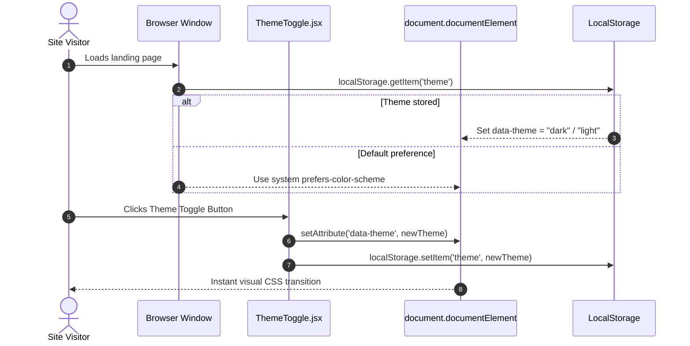
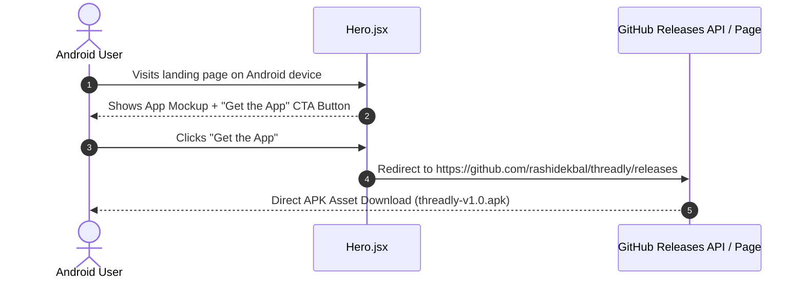
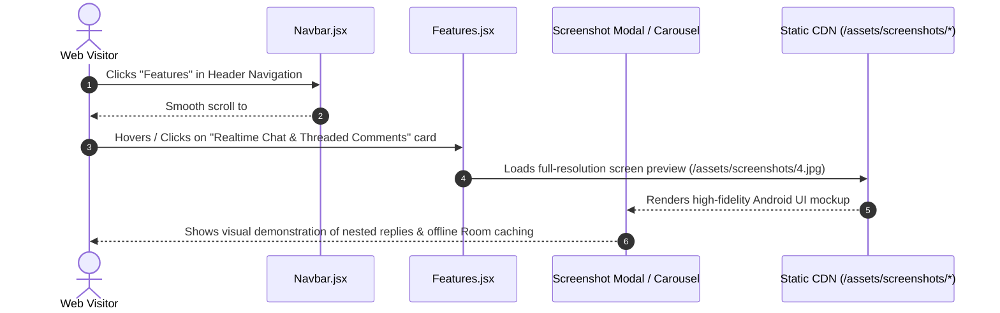

# Core Data Flows & Sequences

## 1. Theme State Initialization & Mutation

```mermaid
sequenceDiagram
    autonumber
    actor Visitor as Site Visitor
    participant Browser as Browser Window
    participant Toggle as ThemeToggle.jsx
    participant DOM as document.documentElement
    participant Storage as LocalStorage

    Visitor->>Browser: Loads landing page
    Browser->>Storage: localStorage.getItem('theme')
    alt Theme stored
        Storage-->>DOM: Set data-theme = "dark" / "light"
    else Default preference
        Browser-->>DOM: Use system prefers-color-scheme
    end

    Visitor->>Toggle: Clicks Theme Toggle Button
    Toggle->>DOM: setAttribute('data-theme', newTheme)
    Toggle->>Storage: localStorage.setItem('theme', newTheme)
    DOM-->>Visitor: Instant visual CSS transition
```

## 2. APK Download User Journey

```mermaid
sequenceDiagram
    autonumber
    actor MobileUser as Android User
    participant Hero as Hero.jsx
    participant GH as GitHub Releases API / Page

    MobileUser->>Hero: Visits landing page on Android device
    Hero-->>MobileUser: Shows App Mockup + "Get the App" CTA Button
    MobileUser->>Hero: Clicks "Get the App"
    Hero->>GH: Redirect to https://github.com/rashidekbal/threadly/releases
    GH-->>MobileUser: Direct APK Asset Download (threadly-v1.0.apk)
```

---

## 3. Interactive Feature Showcase & Screenshot Gallery Flow

```mermaid
sequenceDiagram
    autonumber
    actor Visitor as Web Visitor
    participant Nav as Navbar.jsx
    participant Feat as Features.jsx
    participant Screen as Screenshot Modal / Carousel
    participant Asset as Static CDN (/assets/screenshots/*)

    Visitor->>Nav: Clicks "Features" in Header Navigation
    Nav-->>Visitor: Smooth scroll to #features anchor
    Visitor->>Feat: Hovers / Clicks on "Realtime Chat & Threaded Comments" card
    Feat->>Asset: Loads full-resolution screen preview (/assets/screenshots/4.jpg)
    Asset-->>Screen: Renders high-fidelity Android UI mockup
    Screen-->>Visitor: Shows visual demonstration of nested replies & offline Room caching
```

